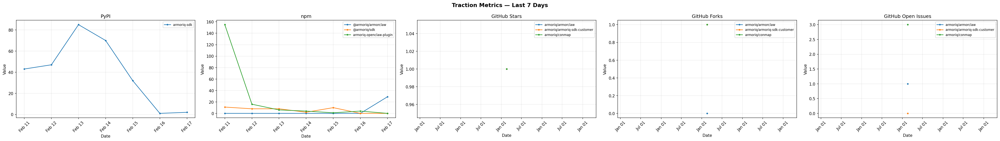
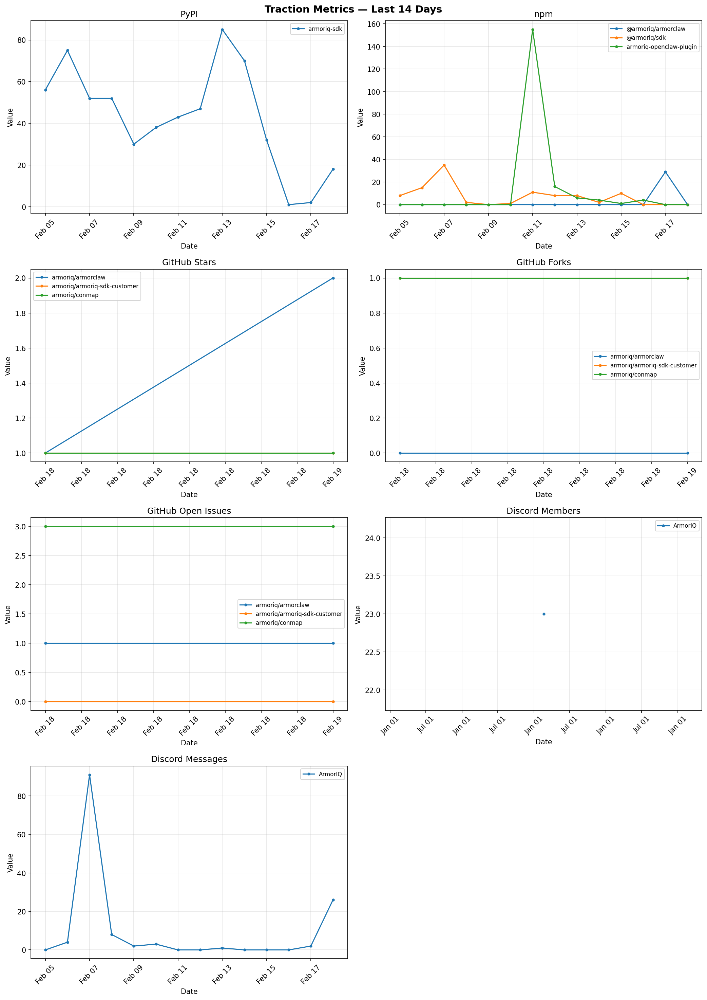
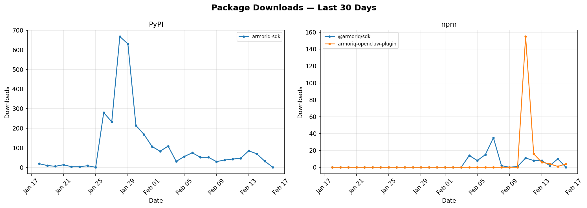
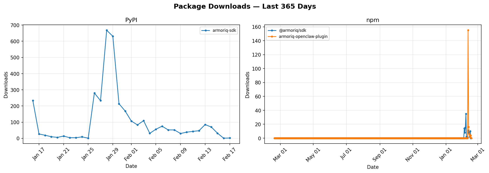
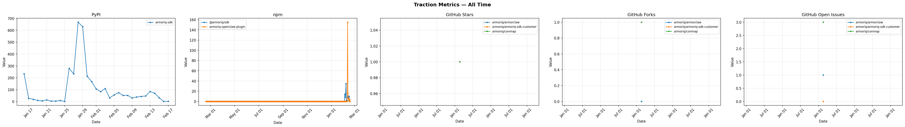

# Package Downloads Dashboard

Automated daily tracking of package download counts from PyPI and npm.

**Last updated:** 2026-02-17

## Tracked Packages

| Package | Source | Latest Downloads | Date |
|---------|--------|-----------------|------|
| @armoriq/sdk | npm | 0 | 2026-02-16 |
| armoriq-openclaw-plugin | npm | 4 | 2026-02-16 |
| armoriq-sdk | pypi | 1 | 2026-02-16 |

## Download Trends

### Last 7 Days

### Last 14 Days

### Last 30 Days

### Last 365 Days

### All Time

---

*Updated daily by [GitHub Actions](.github/workflows/update.yml). Edit [config.yaml](config.yaml) to add or remove packages.*
